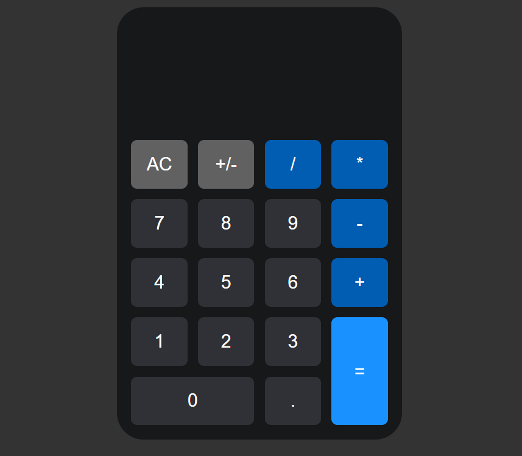

# Exercício com Display Grid CSS

Nesse projeto recriei a interface de uma calculadora usando Grid Layout no CSS e também JavaScript para realizar operações matemáticas e exibir no display da calculadora.

## Stacks utilizadas:
- HTML5
- CSS3
- JavaScript